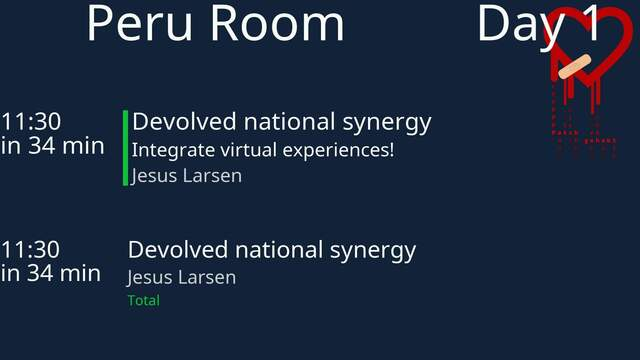
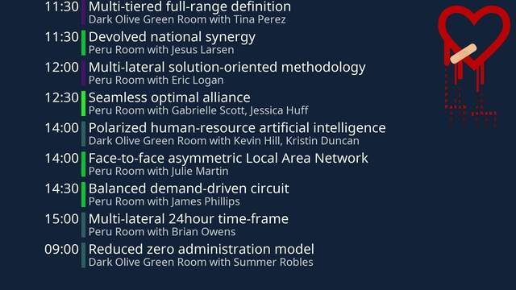

# schedule.json plugin for the info-beamer 'scheduled-player' package

Please note this plugin requires you to install either
[pretalx-broadcast-tools >= 2.1.0](https://github.com/Kunsi/pretalx-plugin-broadcast-tools)
or have something else to generate a schema-compatible `schedule.json`
file (which is available from
[pretalx >= 2024.1.0](https://github.com/pretalx/pretalx))

[Import this package to info-beamer.com](https://info-beamer.com/use?url=https%3A%2F%2Fgithub.com%2FKunsi%2Fscheduled-plugin-pretalx-broadcast-tools.git)

## Features

* show the next talk in the configured room
* show all future (not-yet-ended) talk in all rooms
* show the current conference day
* show the configured room name

The plugin will automatically fetch related information from pretalx
itself. This includes:

* event start date
* event end date
* track information and colours

### Standalone mode

In Standalone mode (aka you deploy this to your pi without scheduled-player)
this plugin will only show a static view of all next talks. This can be
used if you just want to get a list of talks without anything else.

You will get a top bar, showing the current Day on the left, and a 24h
clock on the right, followed by all not-yet-ended talks until all screen
space is filled. The configured fonts will be respected, but the font
sizes are not configurable.

## Screenshots

All talk information have been generated by
`python -m pretalx create_test_event`.

## Next talk

The screenshot shows the room name "Peru Room" on the top left, followed
by the current day information ("Day 1").

In the center, you see the "next talk" display option, showing the talk
title, the abstract and the speaker name next to the information about
when the talk will start, both as a time stamp and a "in xxx min"
information. Inbetween you see the track bar, which is a neon green shade.

On the bottom there's the same view, but this time the abstract and the
track bar is missing. The track name is visible as coloured text below
the speaker name.

## All talks

On this screenshot you can see a listing of nine future talks. The design
follows the "next talk" view, but only shows "in xxx min" for talks less
than 30 minutes into the future, and the time stamp otherwise.

The room information and speaker names are condensed into one line.

